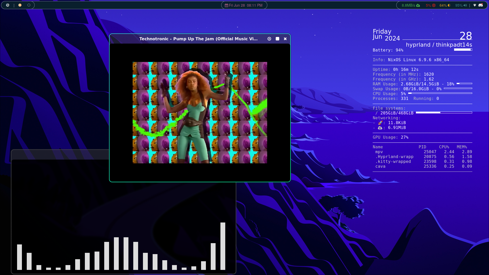
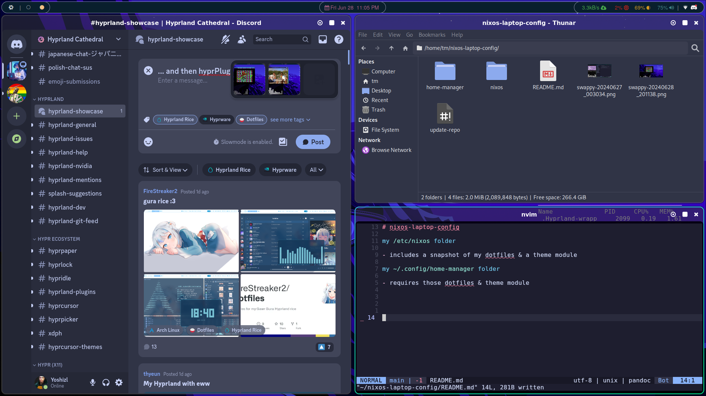
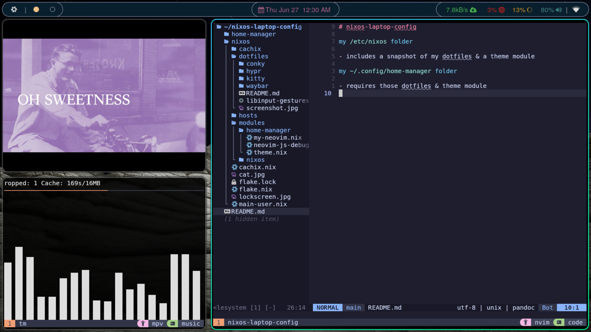

# nixos-laptop-config

[my `/etc/nixos` folder](./nixos/)

- includes a snapshot of my dotfiles & a theme module

[my `~/.config/home-manager` folder](./home-manager/)

- requires those dotfiles & theme module

